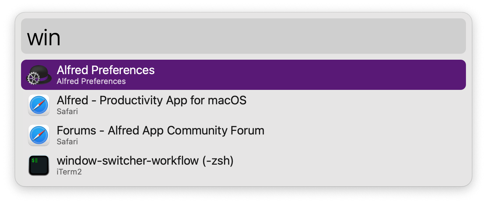

#  Window Switcher Alfred Workflow

Switch to a specific window of an app in the current Desktop Space

<a href='https://github.com/alfredapp/window-switcher-workflow/releases/latest/download/Window.Switcher.alfredworkflow'>⤓ Download Workflow</a>

## About

Use the Hotkey Trigger or run `win` to show app windows in the current Desktop Space.

Type to filter by window or app and ↵ to switch to it.

<a href='https://github.com/alfredapp/window-switcher-workflow/releases/latest/download/Window.Switcher.alfredworkflow'>⤓ Download Workflow</a>
